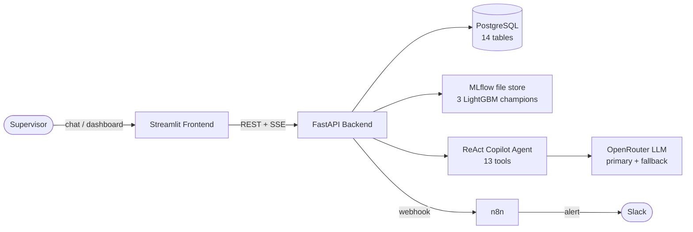

# Manufacturing Process Copilot

> A predictive, explainable, and conversational system for production-delay
> management — full stack, one `docker compose up`.

Manufacturing Process Copilot (MPC) predicts which production orders will be late,
explains *why* with SHAP, and lets a supervisor ask about it all in plain English
through a tool-using AI agent. Built as a portfolio project demonstrating the full
ML engineering lifecycle: **simulation → training → serving → product → reliability**.

<!-- Screenshot placeholder: frontend/docs/screenshots/00_copilot_demo.gif
     (animated GIF of the copilot answering "What orders are at high risk?") -->

---

## Highlights (the 60-second scan)

- 🧠 **Tool-using ReAct copilot** over a live database — 13 typed tools, hardened
  from **25% → 100% core-intent reliability** with measured runtime evidence
  ([eval writeup](docs/11_evaluation.md))
- 📊 **Three LightGBM models** — delay classifier (ROC-AUC **0.911**), delay-minutes
  regressor, and a 6-class root-cause classifier, all with **SHAP** explanations
- 🛡️ **Production-grade LLM client** — typed exceptions, automatic model failover on
  rate limit, and a circuit breaker
- 🔌 **One-command stack** — FastAPI + PostgreSQL + Streamlit + n8n via Docker Compose
- ✅ **Measured, not claimed** — 80-run agent regression, model calibration, API timing

---

## The Business Problem

In discrete manufacturing, a late production order cascades: it blocks machines,
delays downstream orders, and erodes on-time delivery commitments. Supervisors
triage risk largely by intuition and spreadsheets, and they find out an order is in
trouble only once it already is.

MPC turns that reactive process into a proactive one:

- **Predict** delay risk at the moment an order is released (not after it slips).
- **Explain** the prediction in the supervisor's language, so the call is
  defensible and actionable — not a black-box score.
- **Converse** — let the supervisor ask "what's at risk today?" and "why?" without
  learning a dashboard, and surface recommended actions.

---

## What It Does

| Capability | Description |
|---|---|
| **Delay Prediction** | LightGBM binary classifier scores each order's delay probability (ROC-AUC 0.911) |
| **Delay Estimation** | LightGBM regressor estimates delay magnitude in minutes |
| **Root Cause Classification** | 6-class model identifies the dominant delay driver |
| **SHAP Explainability** | Per-order waterfall: top risk factors and mitigating factors with human labels |
| **AI Copilot** | ReAct agent (OpenRouter) answers natural-language questions, grounded in live data |
| **Workflow Automation** | n8n Slack alerts on high-risk orders (probability ≥ 0.70) |

---

## Architecture



Four services run under Docker Compose: **postgres**, **backend**, **frontend**,
**n8n**. The backend loads three LightGBM models from a bind-mounted MLflow file
store at startup, serves the prediction API and the copilot, and exposes webhooks
that n8n calls to push Slack alerts.

- **Agent design** — see [docs/10_agent_architecture.md](docs/10_agent_architecture.md)
  (ReAct loop, tool registry, memory, prompt flow, sequence diagrams).
- **Reliability evaluation** — see [docs/11_evaluation.md](docs/11_evaluation.md).

---

## The AI Copilot

The copilot is a **stateless ReAct agent**. Each turn it reasons (`Thought`),
selects a tool to fetch live data (`Action`), observes the result, and repeats
until it can answer — then emits a grounded, natural-language `FINAL_ANSWER`.

**13 tools across four domains:**

| Domain | Tools |
|---|---|
| Orders | `get_production_order`, `get_active_orders`, `get_orders_at_risk` |
| Predictions | `get_delay_prediction`, `get_risk_summary`, `get_feature_explanation` |
| Analytics | `get_machine_history`, `get_bottlenecks`, `get_shift_summary`, `get_kpi_dashboard` |
| Recommendations | `create_recommendation`, `get_recommendations`, `update_recommendation_status` |

Three design guarantees, each enforced and measured:

- **Never fabricate data** — the prompt forces a tool call before any answer, so a
  guessed answer is format-non-compliant.
- **Never leak scaffolding** — ReAct labels and stray JSON are stripped before any
  text reaches the user.
- **Fail gracefully** — a tool error produces a plain-language explanation, not a
  retry storm or a fallback.

---

## ML Pipeline

All three champion models are LightGBM, trained on **4,293 synthetic production
orders** from a 540-day factory simulation, tracked in MLflow.

| Model | Task | Primary Metric | Value |
|---|---|---|---|
| Binary Classifier | Is order delayed? | ROC-AUC | **0.911** |
| Binary Classifier | Is order delayed? | Average Precision | **0.884** |
| Binary Classifier | Is order delayed? | ECE (calibration) | **0.056** |
| Regression | Delay minutes | MAE | **308.6 min** |
| Root Cause | 6-class driver | Weighted F1 | **0.751** |
| Root Cause | 6-class driver | ROC-AUC (OVR) | **0.848** |

**Feature pipeline:** 37 base features → 4 engineered interaction features → 41
total → a 6-branch `ColumnTransformer` (log+scale, scale-only, binary, ordinal,
count, zero-variance passthrough). Built with scikit-learn 1.4.2, serialised via
MLflow. **Operating thresholds:** 0.65 (prediction flag), 0.70 (Slack alert).

Full ML design: [docs/03_feature_dictionary.md](docs/03_feature_dictionary.md),
[docs/07_transformers_design.md](docs/07_transformers_design.md),
[docs/08_pipeline_design.md](docs/08_pipeline_design.md).

---

## Reliability Results

The copilot shipped functional but unreliable. Through evidence-driven debugging
across three layers (parser, prompt contract, error handling), core-intent
reliability went from **25% to 100%** — with **zero fabricated data** across 80
measured runs. Full methodology and timeline: [docs/11_evaluation.md](docs/11_evaluation.md).

| Metric | Before | After |
|---|---|---|
| Core-intent reliability (6 intents) | ~25% | **100% (60/60)** |
| Fabricated production data | observed | **0 / 80** |
| Raw JSON reaching users | observed | **eliminated** |
| Iterations per answer | 1–5 (unstable) | **2.0** |

---

## Technology Stack

| Layer | Technology |
|---|---|
| **ML training** | scikit-learn 1.4.2, LightGBM ≥4.0, XGBoost 2.0.3, Optuna ≥3.5 |
| **Explainability** | SHAP ≥0.44 (TreeExplainer) |
| **Experiment tracking** | MLflow 2.22.0 (file store) |
| **API** | FastAPI ≥0.115, Pydantic v2, uvicorn |
| **Database** | PostgreSQL 16, SQLAlchemy 2.0 async, asyncpg, Alembic |
| **LLM** | OpenRouter (primary + fallback model), SSE streaming, Ollama fallback |
| **Frontend** | Streamlit ≥1.36, Plotly ≥5.18 |
| **Automation** | n8n (Slack alerts) |
| **Container** | Docker Compose, python:3.12-slim (multi-stage backend) |

---

## Setup

**Prerequisites:** Docker Desktop (or Docker Engine + Compose v2), Git.

```bash
# 1. Clone
git clone <repo-url>
cd manufacturing-process-copilot

# 2. Configure environment
cp .env.example .env
# Edit .env — set OPENROUTER_API_KEY at minimum (get one at openrouter.ai)

# 3. Start the full stack
docker compose up -d --build

# 4. Wait for services to become healthy (~25s)
docker compose ps

# 5. Open
#   Frontend:  http://localhost:8501
#   API docs:  http://localhost:8000/docs
#   Health:    http://localhost:8000/health
#   Readiness: http://localhost:8000/ready
```

**Verify:**

```bash
curl http://localhost:8000/health    # {"status":"ok","version":"0.1.0"}
curl http://localhost:8000/ready     # {"status":"ready","ml_service_loaded":true}
```

**Shut down:**

```bash
docker compose down       # stop, keep data
docker compose down -v    # stop + delete postgres data
```

### Key environment variables

| Variable | Required | Default | Description |
|---|---|---|---|
| `OPENROUTER_API_KEY` | **Yes** | — | LLM routing key |
| `OPENROUTER_MODEL` | No | `qwen/qwen3-next-80b-a3b-instruct:free` | Primary chat model |
| `OPENROUTER_FALLBACK_MODEL` | No | `openai/gpt-oss-120b:free` | Failover model on rate limit |
| `PREDICTION_THRESHOLD` | No | `0.65` | Delay classification cutoff |
| `HIGH_RISK_THRESHOLD` | No | `0.70` | Slack alert trigger |
| `SLACK_WEBHOOK_URL` | No | `""` | Leave empty to disable alerts |

Full list in [.env.example](.env.example).

---

## Screenshots

<!-- Screenshot placeholder: frontend/docs/screenshots/01_copilot_chat.png -->
**1. Copilot Chat** — conversational interface backed by the ReAct agent.

<!-- Screenshot placeholder: frontend/docs/screenshots/02_risk_board.png -->
**2. Risk Board** — today's orders with delay-probability gauges and root-cause labels.

<!-- Screenshot placeholder: frontend/docs/screenshots/03_order_detail.png -->
**3. Order Detail** — per-order SHAP waterfall with human-readable factor labels.

<!-- Screenshot placeholder: frontend/docs/screenshots/04_model_performance.png -->
**4. Model Performance** — champion metrics, feature importance, calibration.

---

## Demo Walkthrough

A scripted 5-minute demo — delay prediction, risk summary, bottleneck detection,
KPI dashboard, the AI copilot, and the reliability story — is in
[docs/12_demo_guide.md](docs/12_demo_guide.md).

**The 90-second version:** open the Risk Board → click a high-risk order to show
the SHAP explanation → ask the copilot *"What orders are at high risk right now?"*
→ follow up *"why is order ORD-… flagged?"* → close on the reliability result
(25% → 100%, zero fabrication).

---

## Future Roadmap

- **Document retrieval (RAG)** — let the copilot cite SOPs and maintenance manuals.
  Attaches to the existing agent as one additional tool (see the extension guide in
  [docs/10_agent_architecture.md](docs/10_agent_architecture.md)).
- **Automated evaluation in CI** — promote the 80-run regression harness to a CI
  gate so reliability is enforced on every change.
- **MLflow Model Registry promotion** — move from pinned run IDs to stage-based
  champion selection.
- **Real-data integration** — replace the synthetic simulation feed with a live MES
  connector.

---

## Repository Structure

```
manufacturing-process-copilot/
├── backend/          FastAPI service — API, ReAct agent, ML service, LLM client
│   └── app/
│       ├── api/routes/   predictions, models, orders, chat, workflows, health
│       ├── db/           SQLAlchemy models + Alembic migrations (14 tables)
│       └── services/
│           ├── agent/    ReAct copilot + 13 tools + memory
│           ├── llm/      OpenRouter client, failover, SSE streaming
│           └── ml/       registry, explainability, prediction service
├── frontend/         Streamlit app — 4 pages (chat, risk board, order detail, model perf)
├── ml/               Training library + notebooks (01_eda … 06_shap_analysis)
├── n8n/workflows/    Workflow automation (high-risk-order alert)
├── docs/             Technical design series (01–12)
├── docker-compose.yml
└── .env.example
```

---

## Documentation

| Document | Contents |
|---|---|
| [01_simulation_architecture](docs/01_simulation_architecture.md) | Factory simulation, 6-layer causal design |
| [02_dataset_schema](docs/02_dataset_schema.md) | Dataset specification, split protocol |
| [03_feature_dictionary](docs/03_feature_dictionary.md) | All ML features: type, range, causal role |
| [04_implementation_roadmap](docs/04_implementation_roadmap.md) | 20-day implementation plan |
| [05_repository_structure](docs/05_repository_structure.md) | Full repo catalogue |
| [06_constants_design](docs/06_constants_design.md) | Preprocessing group design |
| [07_transformers_design](docs/07_transformers_design.md) | Custom transformer specs |
| [08_pipeline_design](docs/08_pipeline_design.md) | sklearn Pipeline + SHAP + MLflow |
| [09_performance_benchmarking](docs/09_performance_benchmarking.md) | Model metrics, API timing |
| [10_agent_architecture](docs/10_agent_architecture.md) | **Copilot agent design** |
| [11_evaluation](docs/11_evaluation.md) | **Reliability evaluation (25% → 100%)** |
| [12_demo_guide](docs/12_demo_guide.md) | **5-minute demo script** |
| [13_evaluation_harness](docs/13_evaluation_harness.md) | **Reproducible reliability harness** (`backend/scripts/eval_copilot.py`) |
| [14_interview_guide](docs/14_interview_guide.md) | Architecture talking points, Q&A, role positioning |
| [15_roadmap](docs/15_roadmap.md) | V1 achievements, lessons, V1.1 / V2, scaling |

---

## License

MIT — see [LICENSE](LICENSE).
