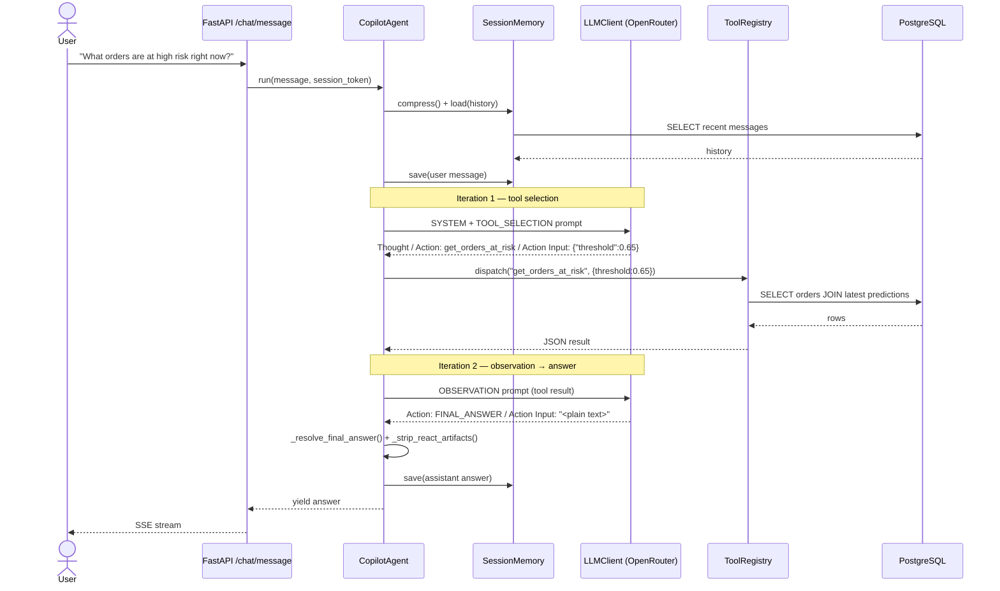
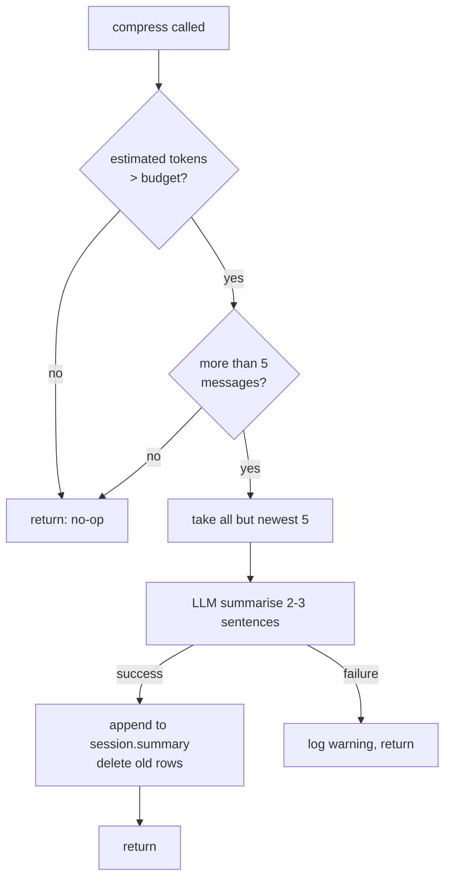
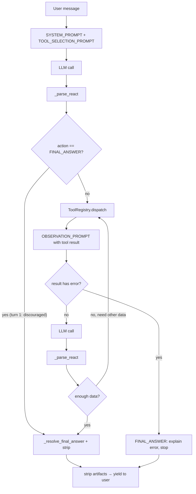
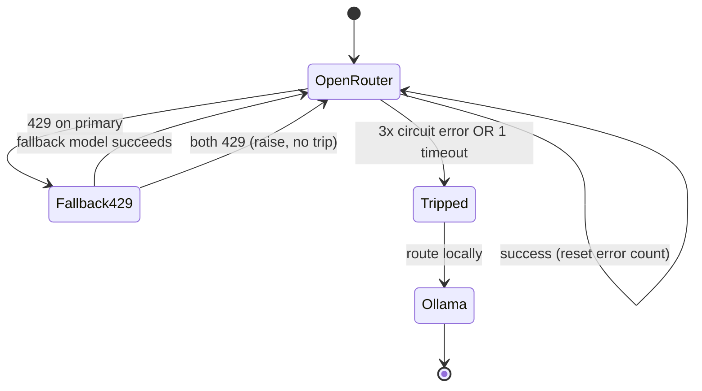

# Document 10 — AI Copilot Agent Architecture

**Status:** Active
**Component:** `backend/app/services/agent/`, `backend/app/services/llm/`
**Audience:** engineers extending the copilot; reviewers evaluating the agent design

---

## 1. Overview

The Manufacturing Process Copilot exposes a conversational interface over the
factory's live production database. A production supervisor can ask questions in
plain English — *"What orders are at high risk right now?"*, *"Why is ORD-… flagged?"*
— and receive grounded, natural-language answers backed by real database queries
and ML predictions.

The agent is a **stateless ReAct (Reason + Act) loop**. Each turn:

1. Reasons about the question (`Thought`).
2. Selects a tool to retrieve live data (`Action` + `Action Input`).
3. Observes the tool result.
4. Repeats until it has enough data, then emits a `FINAL_ANSWER`.

All conversational state lives in the database (`chat_sessions`, `chat_messages`);
the agent object itself holds no per-conversation state. This makes the agent
horizontally scalable and crash-safe — any worker can serve any turn.

### Design principles

| Principle | How it is enforced |
|---|---|
| **Never fabricate data** | Every number or identifier in an answer must originate from a tool result. Enforced at the prompt layer (mandatory first-turn tool call). |
| **Never leak scaffolding** | ReAct labels (`Thought:`, `Action:`) and raw JSON are stripped before any text reaches the user. |
| **Fail gracefully** | Tool errors produce a plain-language explanation, not a retry storm or a stack trace. |
| **Stateless core** | All memory in Postgres; the agent is a pure function of (message, session). |
| **Bounded cost** | Hard iteration cap (`MAX_ITERATIONS = 5`) and LLM-assisted memory compression. |

---

## 2. Component map

```
backend/app/services/
├── agent/
│   ├── agent.py            CopilotAgent — the ReAct loop, parser, sanitizer
│   ├── tool_registry.py    ToolRegistry — name → async callable dispatch
│   ├── memory.py           SessionMemory — load / save / compress (Postgres)
│   └── tools/
│       ├── orders.py          get_production_order, get_active_orders, get_orders_at_risk
│       ├── predictions.py     get_delay_prediction, get_risk_summary, get_feature_explanation
│       ├── analytics.py        get_machine_history, get_bottlenecks, get_shift_summary, get_kpi_dashboard
│       └── recommendations.py  create_recommendation, get_recommendations, update_recommendation_status
└── llm/
    ├── client.py           LLMClient — OpenRouter routing, failover, circuit breaker
    ├── prompts.py          SYSTEM_PROMPT, TOOL_SELECTION_PROMPT, OBSERVATION_PROMPT
    └── streaming.py        SSE formatting for FastAPI StreamingResponse
```

There are **13 registered tools** across four domains. The registry is the only
component that executes tool functions; the agent never calls a tool directly.

---

## 3. The ReAct loop

A single call to `CopilotAgent.run(message, session_token)` is one conversation
turn. Internally it may take up to `MAX_ITERATIONS` LLM round-trips.

### Turn lifecycle

```
1. Load session memory (recent messages + rolling summary), compress if over budget.
2. Persist the user message.
3. Build the initial LLM message list: SYSTEM_PROMPT + TOOL_SELECTION_PROMPT.
4. Loop (max 5 iterations):
     a. Call the LLM.
     b. Parse the response into (thought, action, action_input).
     c. If action == FINAL_ANSWER:
          - resolve the answer text (discarding stray JSON),
          - strip ReAct artifacts,
          - break.
     d. Otherwise: dispatch the named tool, append the observation, repeat.
5. Persist the assistant answer (with the tool-call log).
6. Yield the final answer.
```

### Sequence diagram — successful tool-backed answer



A well-formed turn resolves in **exactly two iterations**: one tool call, one
observation-to-answer step.

---

## 4. The parser

The LLM returns free text in the ReAct format. The parser extracts three fields
with three regexes (`backend/app/services/agent/agent.py`):

```python
_THOUGHT_RE = re.compile(r"Thought:\s*(.+?)(?=\nAction:|\Z)", re.DOTALL | re.IGNORECASE)
_ACTION_RE  = re.compile(
    r"Action\s*:\s*(?!Input\b)(\S+?)(?=\s|$|[\r\n]|(?:Action\s+Input|Thought|Observation))",
    re.IGNORECASE,
)
_INPUT_RE   = re.compile(r"Action Input:\s*(.+)", re.DOTALL | re.IGNORECASE)
```

`_parse_react()` returns `(thought, action, action_input)`. If no `Action:` is
found, the entire response is treated as a `FINAL_ANSWER` to prevent the loop
from stalling.

### Parser robustness

Free-tier models do not reliably emit clean ReAct. `_ACTION_RE` is engineered to
tolerate the observed malformations (see Document 11 for the investigation):

- **Mid-line `Action:`** — the label may appear after prose on the same line
  (`…tool is get_orders_at_risk.Action: get_orders_at_risk`). The regex is *not*
  anchored to line start, so it still matches.
- **Concatenated labels** — when the model omits a newline
  (`Action: get_orders_at_riskAction Input: {…}`), the non-greedy `(\S+?)` plus a
  forward lookahead `(?:Action\s+Input|Thought|Observation)` stops the tool name
  at the next embedded label, recovering `get_orders_at_risk`.
- **`Action Input` protection** — the negative lookahead `(?!Input\b)` prevents the
  parser from mistaking the `Action Input:` label for an action.

### Output sanitization

ReAct scaffolding must never reach the user. `_strip_react_artifacts()` removes,
in order: `<think>…</think>` blocks, `Thought:` lines, `Action Input:` prefixes,
`Action:` lines, `Observation:` lines, and leading `FINAL_ANSWER:` / `Answer:`
prefixes, then collapses blank lines.

`_resolve_final_answer()` is a second guard specific to the answer slot: if the
model places a JSON value where prose belongs, it is discarded.

```python
def _resolve_final_answer(action_input: str, response: str) -> str:
    if not action_input:
        return response
    try:
        parsed = json.loads(action_input)
    except (ValueError, TypeError):
        return action_input          # plain text — normal path
    if isinstance(parsed, str):
        return parsed                # model quoted its prose answer — unwrap
    return response                  # dict/list/number/bool/null — discard
```

This closes the failure where the model echoed tool arguments
(`{"threshold": 0.65, "limit": 20}`) as its final answer.

---

## 5. The tool registry

`ToolRegistry` maps tool-name strings to async callables and their JSON schemas.

```python
registry.register("get_orders_at_risk", orders.get_orders_at_risk, orders.GET_ORDERS_AT_RISK_SCHEMA)
result_json = await registry.dispatch("get_orders_at_risk", {"threshold": 0.65})
```

Key properties:

- **`dispatch()` never raises.** Unknown tools, wrong arguments (`TypeError`), and
  tool-internal exceptions all return a JSON `{"error": "..."}` payload. This keeps
  the loop alive and gives the LLM something to reason about.
- **Schemas drive the prompt.** `tool_descriptions()` renders every registered
  tool's name, description, and parameters into `SYSTEM_PROMPT`. The prompt and the
  executable registry are guaranteed in sync — there is no separate, drift-prone
  tool list.
- **Every tool receives `db` plus its JSON parameters** and returns a dict.

### Registered tools

| Domain | Tools |
|---|---|
| Orders | `get_production_order`, `get_active_orders`, `get_orders_at_risk` |
| Predictions | `get_delay_prediction`, `get_risk_summary`, `get_feature_explanation` |
| Analytics | `get_machine_history`, `get_bottlenecks`, `get_shift_summary`, `get_kpi_dashboard` |
| Recommendations | `create_recommendation`, `get_recommendations`, `update_recommendation_status` |

---

## 6. Memory and compression

`SessionMemory` persists conversation state in two tables and provides a rolling
summary so long conversations stay within the LLM context budget.

- **`load(token, max_messages)`** — returns the most recent N messages in
  chronological order, prepended with the session summary (if any) as a `system`
  message.
- **`save(token, role, content, …)`** — appends a message row; touches
  `session.updated_at`.
- **`compress(token)`** — when estimated tokens exceed the session budget and there
  are more than `_KEEP_RECENT` (5) messages, the oldest messages are summarised by
  the LLM into 2–3 sentences (preserving order numbers, risk levels, decisions),
  appended to `session.summary`, and the original rows are deleted.

Compression is best-effort: if the summarisation LLM call fails, it logs a warning
and returns — it never crashes the turn.



---

## 7. Prompt flow

Three prompt templates (`backend/app/services/llm/prompts.py`) drive the loop.

| Prompt | When | Purpose |
|---|---|---|
| `SYSTEM_PROMPT` | every LLM call | Identity, factory context, tone, and the rendered tool list |
| `TOOL_SELECTION_PROMPT` | first turn (turn-1 user message) | Forces a tool call; forbids first-turn `FINAL_ANSWER`; forbids fabrication; includes one few-shot example |
| `OBSERVATION_PROMPT` | after every tool result | Decides next step; **handles tool errors by stopping and explaining** |

### Why the first turn forbids `FINAL_ANSWER`

`TOOL_SELECTION_PROMPT` states the turn has retrieved no data yet and that the
`Action` **must** be a tool name — `FINAL_ANSWER` is only valid in
`OBSERVATION_PROMPT`, after a tool has run. This is the structural guard against
hallucination: a tool-free first-turn answer is *format-non-compliant*, so the
model cannot legitimately fabricate an answer from parametric knowledge.

### Tool-error handling

`OBSERVATION_PROMPT` leads with an explicit branch:

> If the tool result contains an `"error"` field, do NOT call another tool.
> Immediately respond with `Action: FINAL_ANSWER` and explain the problem to the
> user in plain language.

Without this branch, the model interprets an error result as "not enough
information" and thrashes through unrelated tools until the iteration cap, ending
in a generic fallback. With it, a missing-data condition becomes a clear, single
explanation.

### Prompt → parse → act, end to end



---

## 8. LLM client, failover, and the circuit breaker

`LLMClient` (`backend/app/services/llm/client.py`) routes to OpenRouter with a
local Ollama fallback. It is hardened against the failure modes of free-tier model
endpoints.

### Typed exception hierarchy

HTTP status codes are mapped to typed exceptions so the agent can give precise,
user-appropriate messages:

```
LLMError
├── LLMRateLimitError      HTTP 429
├── LLMAuthError           HTTP 401
├── LLMPermissionError     HTTP 403
├── LLMModelNotFoundError  HTTP 404
├── LLMProviderError       HTTP 5xx
├── LLMTimeoutError        httpx.TimeoutException
└── LLMConnectionError     httpx.ConnectError
```

### Model failover on rate limit

On a `429` from the primary model, the client transparently retries once with
`OPENROUTER_FALLBACK_MODEL` before surfacing `LLMRateLimitError`.

### Circuit breaker

After **3 consecutive circuit-eligible errors** (auth, connection, provider 5xx)
*or a single timeout*, the client trips and routes to Ollama for the remainder of
the process. **Rate limits (429) deliberately do not trip the breaker** — they are
transient and should not permanently degrade the session.



---

## 9. Extension guide

To add a new capability:

1. Write an async function `async def my_tool(db, **params) -> dict` in the
   appropriate `tools/*.py`, returning a JSON-serialisable dict (use
   `{"error": "..."}` for failure cases so the agent handles it gracefully).
2. Declare a schema dict with `description` and `parameters`.
3. Register it in `build_registry()`. The prompt updates automatically via
   `tool_descriptions()`.

No parser, prompt, or loop changes are required — the registry is the single
extension point. This is how a future RAG/knowledge-search tool would attach to the
existing agent.

---

*Document 10 — Manufacturing Process Copilot Technical Series*
