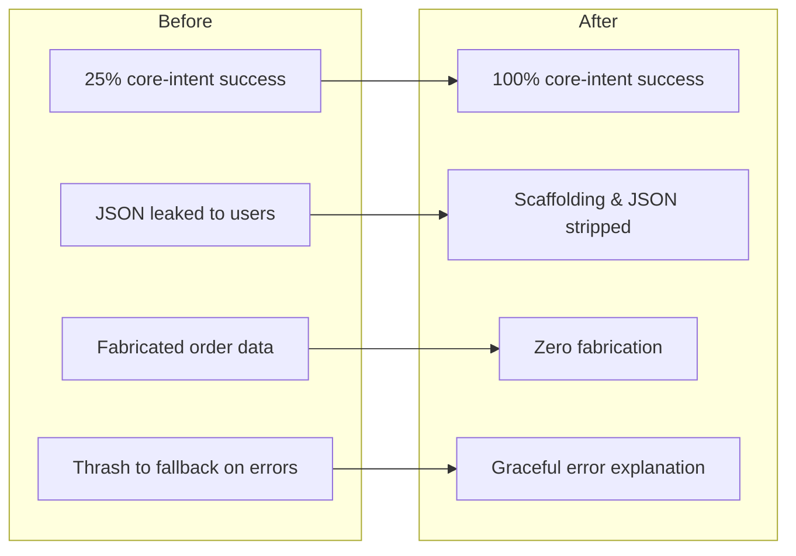

# Document 11 — Copilot Reliability Evaluation

**Status:** Active
**Scope:** end-to-end reliability of the ReAct copilot agent
**Method:** runtime evidence from the live Docker stack — not unit tests, not theory

---

## 1. Summary

The AI copilot began functionally complete but **operationally unreliable**. On
some intents it failed roughly three out of four times — leaking raw JSON to
users, and in the worst cases **fabricating production data** (invented order
numbers and risk scores). For a tool a supervisor is meant to trust, hallucinated
data is the most dangerous failure mode.

This document records how those failures were investigated with runtime evidence,
the three root causes found across three layers (parser, prompt contract,
error handling), the fixes, and an 80-run regression that measured the outcome.

**Headline result:** core-intent reliability went from **25% to 100%**, with
**zero fabricated data** across 80 measured runs.

| Metric (intent: "high-risk orders") | Before | After |
|---|---|---|
| Correct tool-backed answer | 2 / 8 (25%) | 12 / 12 (100%) |
| Fallback responses | 6 / 8 (75%) | 0 / 12 (0%) |
| Fabricated order data | present | 0 |
| Avg iterations to answer | unstable (1–5) | 2.0 |

---

## 2. Methodology

Reliability was measured against the **running system**, not in isolation:

1. **Live requests.** Each test sent a real `POST /api/v1/chat/message` to the
   backend container with a fresh session token, eliminating memory carry-over.
2. **Log correlation.** Every run was traced through the backend's structured agent
   logs (`[AGENT] parsed → action=…`, `dispatching tool …`, `FINAL_ANSWER reached
   at iteration …`), keyed by session token, to recover the exact tool path and
   iteration count — not just the final text.
3. **Repetition.** Each intent was run ≥10 times. Free-tier model output is
   non-deterministic; a single pass proves nothing. Repetition exposed
   intermittent failures a one-shot test would miss.
4. **Ground-truth tool checks.** Where an intent failed, the underlying tool was
   invoked directly against the database to distinguish *agent* failures from
   *data* gaps.

Outcomes were classified as: **OK** (correct tool-backed answer), **Fallback**
(generic "couldn't retrieve" message), or **Hallucination** (fabricated
identifiers/metrics in the answer).

---

## 3. Failure investigation timeline

The investigation proceeded as a sequence of audits, each producing evidence that
narrowed the next. Critically, **the first hypothesis was wrong**, and runtime
evidence corrected it — which is the point of measuring rather than guessing.

### Stage 1 — Symptom capture

Live runs of *"What orders are at high risk right now?"* failed ~75% of the time.
Logs showed three distinct shapes:

- `parsed → action='get_orders_at_riskAction'` — a corrupted tool name.
- `parsed → action='FINAL_ANSWER'` with JSON in the answer slot.
- Fallback responses with no tool dispatch at all.

### Stage 2 — Parser investigation (and a corrected hypothesis)

**First hypothesis:** the `Action` regex `\S+` was greedily consuming the next
label. A line-anchored pattern was introduced. **Runtime re-test proved it
insufficient** — the live model frequently emitted `Action:` *mid-line* after
prose (`…the appropriate tool is get_orders_at_risk.Action: get_orders_at_risk`),
and the `^`-anchored regex *missed it entirely*, causing the whole response to be
misclassified as a `FINAL_ANSWER` and then erased by the Thought-stripper.

The corrected fix removed the line anchor and used a non-greedy capture with a
label-boundary lookahead plus a negative lookahead guarding `Action Input`:

```python
_ACTION_RE = re.compile(
    r"Action\s*:\s*(?!Input\b)(\S+?)(?=\s|$|[\r\n]|(?:Action\s+Input|Thought|Observation))",
    re.IGNORECASE,
)
```

This stage produced a lasting lesson: **a static regex audit was not enough; the
live model's output distribution was the real specification.**

### Stage 3 — The parser fix did not move the metric

The corrected parser was validated case-by-case and was correct — yet a fresh
8-run live test still failed 6/8. **The dominant live failures were not the ones
the parser addressed.** Capturing the raw model output revealed two different
problems:

- **Truncation:** the model emitted only a `Thought:` line and stopped — no
  `Action:` at all.
- **Hallucination:** the model skipped the tool entirely and fabricated a full
  answer with invented order IDs and risk percentages.

Neither is a parser bug. No regex can recover an `Action:` line the model never
produced. This redirected the investigation to the **prompt contract**.

### Stage 4 — Prompt contract investigation

Auditing `TOOL_SELECTION_PROMPT` exposed the root cause of both remaining
failures:

- `Action: <tool_name> or FINAL_ANSWER` offered `FINAL_ANSWER` as a **valid
  first-turn choice**. Answering immediately — including from fabrication — was
  therefore *format-compliant*. The only prohibition ("don't answer from session
  memory") did not cover parametric hallucination.
- The three output lines were shown as a `<placeholder>` template, never stated as
  **mandatory**, so the model treated `Action:`/`Action Input:` as optional and
  truncated after `Thought:`.
- There were **zero few-shot examples** — a known reliability gap for free-tier
  models.

### Stage 5 — Error-handling investigation

After the prompt fix, intents 1–6 were perfect, but the prediction-explanation
intents thrashed. Direct tool invocation showed
`get_delay_prediction("ORD-20260601-001")` returns
`{"error": "No prediction found"}`. `OBSERVATION_PROMPT` had **no error branch**,
so the model read the error as "not enough information" and called unrelated tools
until the iteration cap — ending in a fallback. This is a *data gap surfaced as a
prompt gap*, not a code defect.

---

## 4. Root causes and fixes

| # | Layer | Root cause | Fix | File |
|---|---|---|---|---|
| 1 | Parser | `Action:` regex missed mid-line labels and mis-handled concatenated labels | Non-greedy capture, label-boundary lookahead, no line anchor, `(?!Input\b)` guard | `agent.py` `_ACTION_RE` |
| 2 | Parser | Tool args (JSON) echoed as the final answer leaked to users | `_resolve_final_answer()` discards non-string JSON in the answer slot | `agent.py` |
| 3 | Prompt | First-turn `FINAL_ANSWER` allowed → licensed hallucination; lines optional → truncation | Mandatory first-turn tool call; explicit no-fabrication rule; all three lines required; one few-shot example | `prompts.py` `TOOL_SELECTION_PROMPT` |
| 4 | Prompt | No tool-error handling → thrash to fallback on missing data | Explicit "on error: stop and explain in plain language" branch | `prompts.py` `OBSERVATION_PROMPT` |

Every fix followed the same discipline: **minimum change, then re-measure on the
live system.**

---

## 5. The 80-run regression

After the parser and prompt fixes, an 80-request regression covered 8
supervisor intents (10 runs each), correlated to backend logs.

### Per-intent results

| # | Intent | Tool selected | Dispatch success | Hallucination | Fallback | Avg iter |
|---|---|---|---|---|---|---|
| 1 | High-risk orders | `get_orders_at_risk` | 10/10 | 0 | 0 | 2.1 |
| 2 | Risk summary | `get_risk_summary` | 10/10 | 0 | 0 | 2.0 |
| 3 | Shift performance | `get_shift_summary` | 10/10 | 0 | 0 | 2.0 |
| 4 | Bottlenecks | `get_bottlenecks` | 10/10 | 0 | 0 | 2.0 |
| 5 | Active orders | `get_active_orders` | 10/10 | 0 | 0 | 2.0 |
| 6 | Facility KPIs | `get_kpi_dashboard` | 10/10 | 0 | 0 | 2.0 |
| 7 | Explain delay (ORD-…001) | `get_delay_prediction` | dispatched; data gap | 0 | high | ~4.0 |
| 8 | Why delayed | `get_delay_prediction` | dispatched; data gap | 0 | high | ~4.0 |

### Aggregate

- **80/80 runs dispatched a tool** — no run answered without calling a tool. The
  hallucination escape hatch is closed.
- **0 unknown-tool dispatches, 0 invalid-argument errors, 0 tool exceptions.**
- **0 fabricated identifiers** — the only order ID appearing in any answer was the
  one the user supplied.
- **Intents 1–6: 60/60 = 100%**, each resolving in the ideal 2 iterations.

### The two unstable intents

Intents 7–8 were unstable for a single, identified reason: **no prediction row
exists for the demo order**, so `get_delay_prediction` correctly returns an error.
This is a data-seeding gap, not an agent defect.

### Targeted error-handling fix and re-test

The `OBSERVATION_PROMPT` error branch (root cause #4) was then added and the
prediction intent re-run 10 times:

| Metric (intent: "explain delay ORD-…001") | Before error fix | After error fix |
|---|---|---|
| Fallback rate | high (iteration exhaustion) | 0 / 10 |
| Avg iterations | ~4.0 (up to 5) | 2.0 |
| Tool thrashing | 3–5 tools per run | eliminated — `get_delay_prediction` only |
| User-facing output | generic fallback | clear "no prediction available for that order" |

Logs confirmed: `FINAL_ANSWER reached at iteration 2` ×10, a single
`get_delay_prediction` dispatch per run, zero other tools.

---

## 6. Before / after



| Dimension | Before | After |
|---|---|---|
| Core-intent reliability (intents 1–6) | ~25% | **100% (60/60)** |
| Fabricated production data | observed | **0 / 80** |
| Raw JSON reaching users | observed | **eliminated** |
| Error handling | thrash → fallback | stop → plain-language explanation |
| Iterations per answer | 1–5 (unstable) | **2.0 (deterministic shape)** |

---

## 7. Lessons learned

1. **Measure on the live system, not in isolation.** The first parser fix was
   correct in unit terms yet moved the production metric by zero, because the
   dominant failure was elsewhere. Only live, repeated runs revealed the true
   distribution of model behavior.

2. **Non-determinism demands repetition.** A free-tier model produces a different
   shape each call. Single-pass testing would have declared victory after the
   first lucky run. Ten runs per intent exposed the real failure rate.

3. **The prompt is part of the contract, not decoration.** The most damaging
   failure — fabricated data — was not a code bug. It was the prompt *permitting* a
   first-turn answer. Closing that with a structural rule (mandatory tool call) was
   higher-leverage than any parser change.

4. **Distinguish agent failures from data gaps.** Intents 7–8 looked like agent
   instability but were a missing database row. Diagnosing this required invoking
   the tool directly. Fixing the *symptom* (thrashing) at the prompt layer, and
   noting the *cause* (seeding) separately, kept the two concerns clean.

5. **Minimum change, then re-measure.** Each fix was the smallest edit that
   addressed one root cause, followed by a fresh live run. This prevented compound
   regressions and produced a clear causal record of what each change bought.

6. **Hallucination is the worst failure for a trusted tool.** A fallback message is
   honest; fabricated risk scores are dangerous. The reliability work prioritized
   eliminating fabrication over eliminating fallbacks — the right ordering for a
   decision-support product.

---

## 8. Known limitations and next steps

- **Prediction-explanation intents depend on seeded prediction data.** The demo
  order needs a prediction row; until seeded, those intents correctly report "no
  prediction available."
- **Answer-envelope edge case.** The model occasionally wraps prose in a JSON
  envelope (`{"message": "…"}`); `_resolve_final_answer` handles structural JSON
  but this presentation variant warrants a follow-up.
- **Evaluation is manual.** The 80-run harness is scripted but not yet a CI gate.
  Promoting it to an automated regression suite is the natural next step.

---

*Document 11 — Manufacturing Process Copilot Technical Series*
